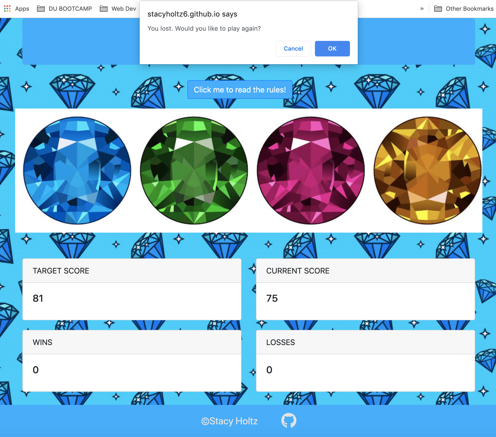
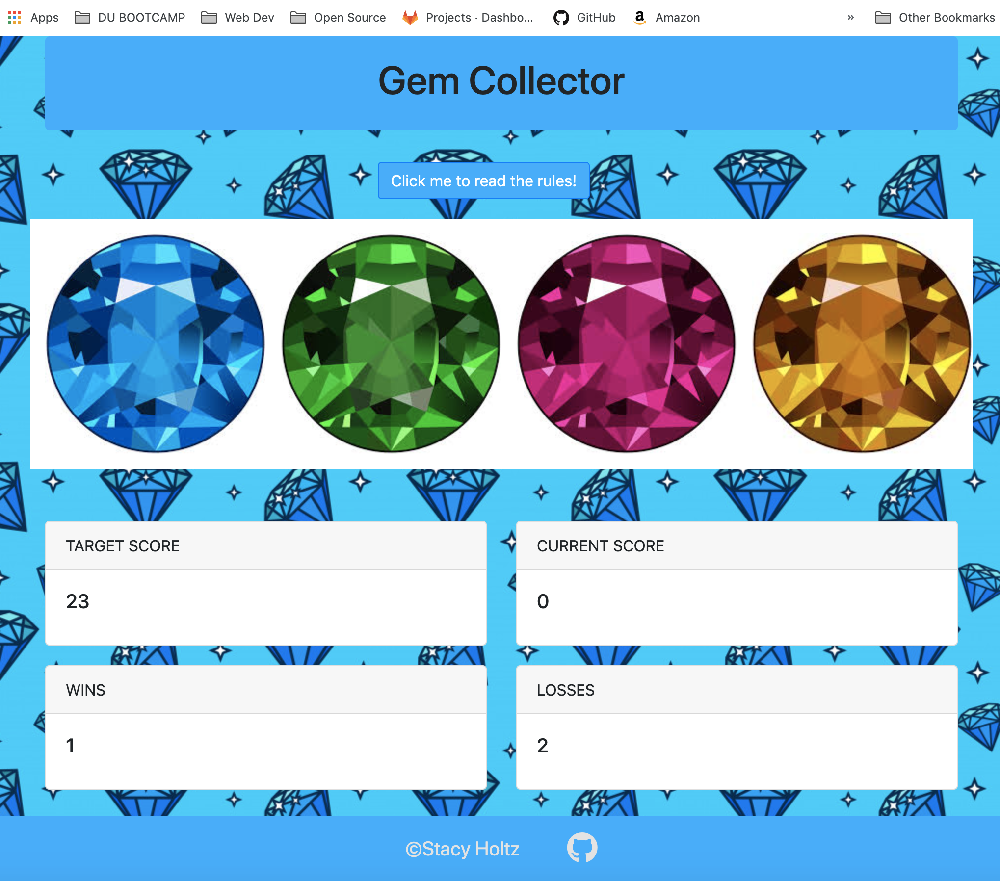

# unit-4-game / Gem Collector

### Link to Live Game:
[Unit-4-Game](https://stacyholtz6.github.io/unit-4-game/)

## Game Objective:
```
--- Use the gems to get your score to match the number randomly chosen by the computer. 
```

##### Game Instructions:
```
1. Click on the intructions button for full instructions. 
2. The target Score is a randomly chosen number. 
3. Each one of the gems is also assigned a randomly chosen number. 
4. Click on the gems to add to your score to match the target Score.
5. You win if your score is equal to the target score.
4. You lose if your score is greater than the target score. 

```
###### Tips:
```
--- Write down the gem values to help you keep track. The values change each time the game resets. 

```

## Tools/Languages Used:
```
--- Javascript
--- JQuery
--- Bootstrap
--- HTML/CSS
```
## Game Features:

##### Start Screen:
```
FUNCTIONALITY:
- Target score is the number that is randomly chosen at the start of each game.
- Current score is the number that the user is accumulating by clicking the gems.
- Wins/Losses are tracked for each game. 
- At the end of each round the user is asked if they want to play again. If the user     clicks O.K. the game resets otherwise the game stops.
- Click the "game intructions" button to get instructions on how to play the game.
- Game starts when a user clicks on any of the gems. 
```
#### Game Play Examples:

###### Rules Modal
```
- Click the button to get the rules/instructions
```


###### Gem Clicking
```
- Hover over a gem and it rotates so you know which gem you are selecting
- Sound plays when you click a gem. POP!!
```


###### Game over alerts
```
- User is give the choice to restart or quit after each round. 
```


###### Wins and Losses Tracking
```
- Wins and Losses are tracked every round. 
```
